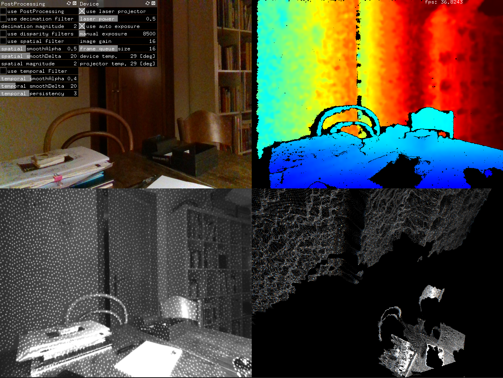

# RealSense SDK addon for openframeworks 0.11.x

Currently supported:
* RGB Streaming
* Depth Streaming (Raw Depth and Depth as Color)
* Point Cloud

Most important realsense parameters can be controlled with ofParameter, including postprocessing filters.

## Cameras

Tested:
* Intel® RealSense™ Depth Cameras D435

Untested:
* Intel® RealSense™ Depth Cameras D415
* Intel® RealSense™ Depth Modules D400, D410, D420, D430
* Intel® RealSense™ Vision Processor D4m
* Intel® RealSense™ Tracking Module (limited support)

## Supported Platforms

Tested:
* Windows 10 (Build 1803 or later)
* OSX 10.15.3

Untested:
* Ubuntu 16.04/18.04 LTS (Linux Kernels 4.4, 4.8 ,4.10, 4.13 and 4.15)
* Windows 8.1

## Dependecies

* Openframeworks release [0.11.0](http://openframeworks.cc/download).

### Windows
* Microsoft Visual Studio Community edition 2017 https://visualstudio.microsoft.com/de/downloads/

### OSX
* XCode 11.3

### For the examples project:
* Openframeworks addon ofxGui

## Installation

* Clone/unzip this repo into the **\<openframeworks>/addons/** folder.
* BE AWARE: This repo is [using LFS](https://www.atlassian.com/git/tutorials/git-lfs) for its binary libraries..

### Instructions

Use project generator to create the Visual Studio and XCode project files by pressing 'import' and navigate to this addons example folder. press 'update'.

#### Windows exe

1. copy
   * /libs/IntelRealSense_2.xx.x/lib/vs/x64/Intel.Realsense.dll
   * /libs/IntelRealSense_2.xx.x/lib/vs/x64/realsense2.dll
   * /libs/IntelRealSense_2.xx.x/lib/vs/x64/realsense2.lib

   into the **bin** folder before you build the app.

2. Open Visual Studio 17, choose solution platform **x64** and build the app. (only libraries for x64 are provided with this ofx)

#### OSX app

-- to be added

## credits

Martin Froehlich

this addon is loosely based on https://github.com/SethGibson/ofxRSSDK, however it has been heavily altered on order to make it compatible with the current RSSDK.

contains the relevant libraries/includes from Intel® RealSense™ SDK 2.0 (build 2.33.1) https://github.com/IntelRealSense/librealsense
